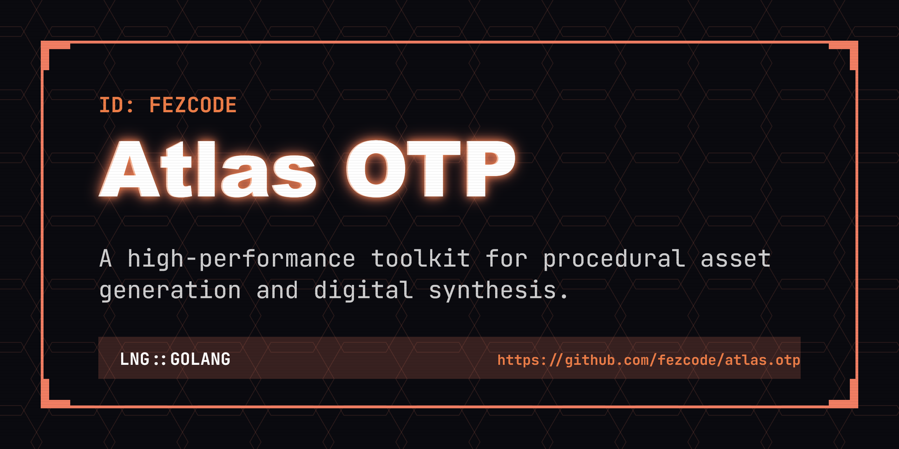

# atlas.otp



**atlas.otp** is a high-visibility, minimalist terminal TOTP (2FA) manager. Part of the **Atlas Suite**, it provides a secure and elegant way to manage your one-time passwords with a clean "Onyx & Gold" aesthetic.


## ✨ Features

- 🔐 **Secure TOTP Generation:** Standard 2FA support for all major services.
- 🎨 **High-Visibility Styling:** Uses the signature Atlas Onyx & Gold theme.
- ⏳ **Real-time Progress:** Visual bar showing code expiration.
- 📋 **Quick Copy:** One-key copying to clipboard.
- ⌨️ **TUI Experience:** Fast navigation and account management.
- 📦 **Zero Dependencies:** Single portable binary.

## 🚀 Installation

### From Source
```bash
git clone https://github.com/fezcode/atlas.otp
cd atlas.otp
gobake build
```

## ⌨️ Usage

Simply run the binary to start the interactive manager:
```bash
./atlas.otp
```

## 🕹️ Controls

| Key | Action |
|-----|--------|
| `↑/↓` / `j/k` | **Navigate:** Move through accounts. |
| `a` / `n` | **Add:** Create a new OTP account. |
| `d` / `x` | **Delete:** Remove selected account. |
| `c` / `Enter` | **Copy:** Copy current OTP code to clipboard. |
| `?` | **Help:** Toggle detailed key bindings. |
| `q` / `Ctrl+C` | **Quit:** Exit the application. |

## 🏗️ Building

The project uses **gobake** for orchestration:

```bash
# Build for all platforms
gobake build
```

## 📄 License
MIT License - see [LICENSE](LICENSE) for details.
